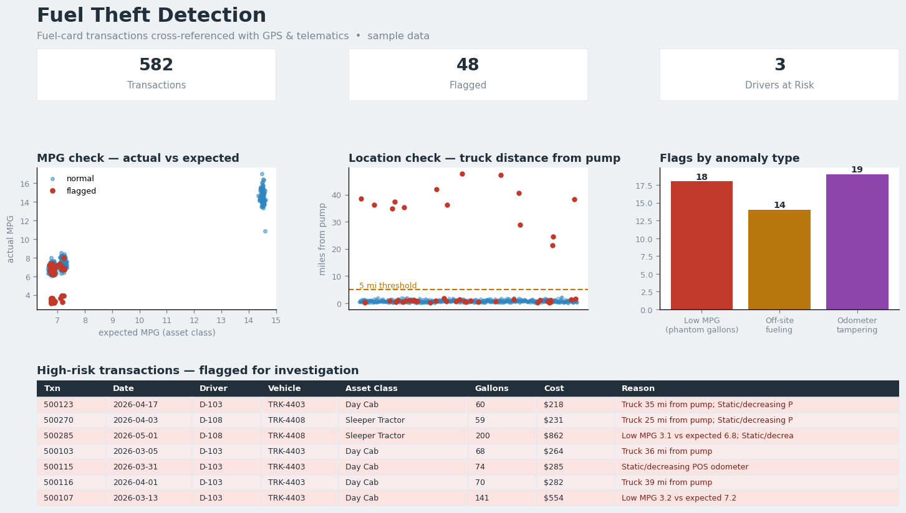

# Fuel Theft Detection

A reporting and anomaly-detection project that cross-references **fuel-card
transactions** against **GPS / telematics data** to surface likely fuel theft —
phantom gallons, off-site fueling, and odometer tampering — and points
investigators straight at the highest-risk drivers.

> **Background:** At Charger Logistics I built this as a **Tableau** dashboard on
> GPS and sensor data to detect and flag potential fuel-theft patterns,
> improving operational risk management. This repo reproduces the detection logic
> in **Python** so it runs and can be reviewed. All data here is synthetic.

## Dashboard



## The idea

A fuel-card transaction on its own looks fine. It's only suspicious when it
disagrees with where the truck actually was and how far it actually drove. By
joining the fuel-card feed to the telematics feed, three independent checks
become possible.

**1. MPG check — phantom gallons**
Using the automated GPS odometer, calculate miles driven between fills and derive
actual MPG. Compare against the expected MPG for that asset class (Sleeper
Tractor, Day Cab, Cargo Van). A truck showing 3 MPG when it should do 7 bought
far more fuel than it could have burned.

**2. Location check — off-site fueling**
Compare the truck's GPS position at the transaction timestamp with the pump's
location. If the vehicle was miles away from the pump when the card was swiped,
the fuel didn't go into that truck.

**3. Odometer check — tampering**
Compare the point-of-sale odometer entry against the trusted GPS odometer. Static,
decreasing, or wildly inflated manual entries are used to mask excess purchases.

Each transaction is scored, flagged with a plain-English reason, and rolled up
into a **driver risk summary** so investigation can start with the worst
profiles.

## Example output

```
Reviewed 582 fuel transactions across 18 vehicles.
Flagged 48 transactions (3 drivers).
Cost exposure on flagged fills: $18,070.86
```

The audit isolates exactly the drivers with abnormal patterns:

| Driver | Flagged txns | Total flags | $ exposure |
|--------|-------------:|------------:|-----------:|
| D-108  | 20 | 22 | $8,508.05 |
| D-114  | 16 | 16 | $5,318.36 |
| D-103  | 12 | 13 | $4,244.45 |

Full results: [`reports/flagged_transactions.csv`](reports/flagged_transactions.csv)
and [`reports/driver_risk_summary.md`](reports/driver_risk_summary.md).

## How to run

```bash
pip install -r requirements.txt
python fuel_theft_audit.py --txns data/fuel_transactions.csv \
    --vehicles data/vehicles.csv --outdir reports
```

## From detection to action

The dashboard was the front end of a process: isolate outlier driver/route
profiles, physically inspect the flagged trucks (bypassed anti-siphon devices,
damaged tank caps, tampered fuel-return lines), and tighten card security —
locking fuel cards to specific VINs and requiring a driver PIN at every fill-up.

## Tech

**In production:** Tableau, GPS / telematics data, fuel-card reports
**In this repo:** Python, pandas
